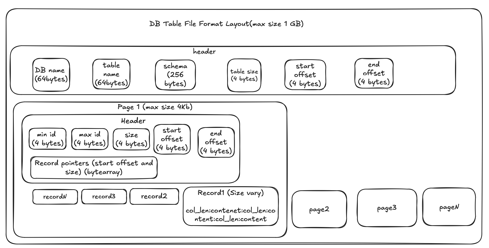

# Toy database for study purposes

This Database is mean to be a transactional database similar to postgres and the intention is for me to learn all the concepts behind one database. This will be initially implemented on python and later I will try to re-implement the same on a low level programming language. 

The database currently contains two modules:

* data_layout: contain all the logic to encode,decode,read and write a binary file database
* executor: contains all the logic to build an execute queries on the database.

### Supported Features

* Query Projection
* Query Selection
* Query Sorting: Does not support multi-page sorting
* Query Limit and Offset
* Query Grouping: functions count, sum, avg
* Insertion: single and bulk
* Query Joins: Nested Loop Joins, Hash Join, Merge Join

### File Format Layout

### Setup
* input dataset: https://grouplens.org/datasets/movielens/20m/